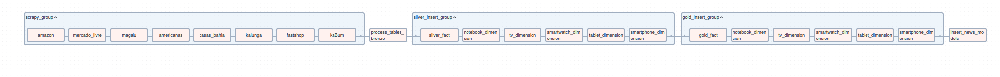

# Tech Warehouse: Pipeline de Análise de E-commerce


Um sistema avançado de coleta e análise de dados de e-commerce, utilizando web scraping, processamento de linguagem natural (NLP - Machine Learning), e uma arquitetura de dados moderna com Apache Airflow e Docker. O projeto implementa uma arquitetura medallion (raw → bronze → silver → gold) para processamento e análise de dados de produtos.

## 📑 Índice

- [Visão Geral](#visão-geral)
- [Sites Monitorados](#sites-monitorados)
- [Tecnologias Utilizadas](#tecnologias-utilizadas)
- [Arquitetura](#arquitetura)
- [Pipeline de Dados](#pipeline-de-dados)
- [Instalação](#instalação)
- [Configuração](#configuração)
- [Modelos de Dados](#modelos-de-dados)
- [Processamento NLP](#processamento-nlp)
- [KPIs e Analytics](#kpis-e-analytics)
- [Roadmap](#roadmap)
- [Contribuição](#contribuição)

## 🎯 Visão Geral



O Tech Warehouse é uma solução end-to-end para análise de produtos em e-commerces, combinando web scraping automatizado, processamento de dados e análise avançada com NLP.

- Web scraping automatizado de múltiplas fontes
- Processamento e normalização de dados através de uma arquitetura medallion
- Análise avançada utilizando NLP com modelos customizados
- Geração de insights e KPIs para análise de mercado
- Integração com reviews de produtos via YouTube pytube

## 🌐 Sites Monitorados

### Principais E-commerces
- **Amazon Brasil**
- **Magazine Luiza**
- **Mercado Livre**
- **Kabum**
- **Americanas**
- **Kalunga**
- **FastShop**
- **Casas Bahia**

## 🛠 Tecnologias Utilizadas

### Core Technologies
- **Python 3.12**
- **Apache Airflow**
- **Docker & Docker Compose**
- **PostgreSQL**

### Frameworks & Libraries
- **Web Scraping**:
  - Scrapy
  - BeautifulSoup4
  - Selenium
  
- **Data Processing**:
  - Pandas
  - SQLAlchemy
  - Pydantic 2.8.2
  
- **NLP & Machine Learning**:
  - SpaCy
  - Custom NER Models
  
- **Integrations**:
  - PyTube
  - Python-dotenv
  - Psycopg2

## 🏗 Arquitetura

### Estrutura de Diretórios
```
tech-warehouse/
├── ingestion/           # Scripts de ingestão de dados
├── models/             # Modelos SQL e definições de schema
├── tasks/              # Tasks do Airflow
├── transformation/     # Lógica de transformação de dados
├── utils/              # Utilitários e helpers
└── web_scrappy/       # Scripts de web scraping
```

### Cobertura de Produtos
- Smartphones
- Smart TVs
- Smartwatches
- Tablets
- Notebooks
## 🚀 Instalação

### Pré-requisitos
- Docker Desktop
- Python 3.12+

### Setup
1. Clone o repositório:
   ```bash
   git clone https://github.com/PauloJaka/Tech-Warehouse
   cd Tech-Warehouse
   ```

2. Configure as variáveis de ambiente:
   ```bash
   cp .env.example .env
   # Edite .env com suas credenciais
   # Coloque o numero de workers que vai ser quantas paginas vai ter uma instância
   # Do selenium rodando no scrappy que altera apenas no tempo, mas pode travar se
   # seu computador seja fraco e coloque muitas instancias de vez recomendado: 2
   ```

3. Inicie os containers:
   ```bash
   #Apos criar a imagem e colocar o nome dela no docker compose
   docker compose airflow-init
   docker compose up --build
   ```

4. Acesse o Airflow:
   ```
   URL: http://localhost:8080
   User: airflow
   Password: airflow
   ```

## ⚙️ Configuração

### Docker & Airflow
```dockerfile
# Exemplo de configuração no Dockerfile
FROM apache/airflow:2.9.2

USER root

ARG firefox_ver=129.0.1
ARG geckodriver_ver=0.35.0

RUN apt-get update && apt-get install -y --no-install-recommends \
    ca-certificates \
    curl \
    bzip2 \
    libgl1 \
    libpci3 \
    libgtk-3-0 \
    libdbus-glib-1-2 \
    libasound2 \
    && update-ca-certificates \
    \
    # Download and install Firefox
    && curl -fL -o /tmp/firefox.tar.bz2 https://ftp.mozilla.org/pub/firefox/releases/${firefox_ver}/linux-x86_64/en-GB/firefox-${firefox_ver}.tar.bz2 \
    && tar -xjf /tmp/firefox.tar.bz2 -C /tmp/ \
    && mv /tmp/firefox /opt/firefox \
    \
    # Download and install geckodriver
    && curl -fL -o /tmp/geckodriver.tar.gz https://github.com/mozilla/geckodriver/releases/download/v${geckodriver_ver}/geckodriver-v${geckodriver_ver}-linux64.tar.gz \
    && tar -xzf /tmp/geckodriver.tar.gz -C /tmp/ \
    && chmod +x /tmp/geckodriver \
    && mv /tmp/geckodriver /usr/local/bin/ \
    \
    # Cleanup unnecessary stuff
    && apt-get purge -y --auto-remove \
    && rm -rf /var/lib/apt/lists/* /tmp/*

ENV MOZ_HEADLESS=1

USER airflow
RUN pip install --no-cache-dir pydantic==2.8.2
```


## 🧠 Processamento NLP

### Modelos Customizados
- Smartphones
- TVs
- Smartwatches
- Tablets

### Fine-tuning
```python
config = {
with nlp.disable_pipes(*other_pipes):
batches = minibatch(training_data, size=compounding(4.0, 32.0, 1.001))
nlp.update([example], drop=0.5, sgd=optimizer, losses=losses)
}
```

## 📈 KPIs e Analytics

- Análise de Preços
- Comparativo entre Vendedores
- Insights de Mercado
- Métricas de Engajamento


## 📊 Modelos de Dados

### Star Schema
- **Fact Tables**
  - `f_bronze` (Dados normalizados iniciais)
  - `f_prata` (Dados processados pelo NER)
  - `f_gold` (Dados agregados para análise)
  
- **Dimension Tables Bronze**
  - `d_bronze_notebooks`
  - `d_bronze_smartphone`
  - `d_bronze_smartwatch`
  - `d_bronze_tablets`
  - `d_bronze_tv`

- **Dimension Tables Prata**
  - `d_prata_notebooks`
  - `d_prata_smartphone`
  - `d_prata_smartwatch`
  - `d_prata_tablets`
  - `d_prata_tv`

- **Dimension Tables Ouro**
  - `d_gold_notebooks`
  - `d_gold_smartphone`
  - `d_gold_smartwatch`
  - `d_gold_tablets`
  - `d_gold_tv`

## 🛣 Roadmap

### ✅ Implementado
- [x] Extração automatizada de dados dos principais e-commerces
- [x] Fine-tuning dos modelos NER com datasets específicos por categoria
- [x] Layer Bronze: Normalização e validação inicial dos dados
- [x] Layer Prata: Processamento otimizado com NER para dados incrementais
- [x] Layer Ouro: Análise via SQL otimizado para agregações
- [x] Fact tables específicas por layer (f_bronze, f_prata, f_gold)
- [x] Dimension tables por categoria de produto em cada layer

### 🚧 Em Desenvolvimento
- [ ] API REST para acesso aos dados processados
- [ ] Dashboard em Real-time com Power-Bi
- [ ] Sistema de alertas de preços
- [ ] Expansão para novas categorias de produtos
- [ ] Machine Learning para previsão de preços

### 📋 Planejado
- [ ] Integração com mais e-commerces
- [ ] Sistema de recomendação de produtos
- [ ] Análise de sentimento de reviews
- [ ] Export automatizado para BI tools
- [ ] Mobile app para alertas e monitoramento

## 🤝 Contribuição

Contribuições são bem-vindas! Por favor, leia nosso guia de contribuição para mais detalhes.

## 📝 Licença

Este projeto está sob a licença MIT. Veja o arquivo [LICENSE](LICENSE) para mais detalhes.